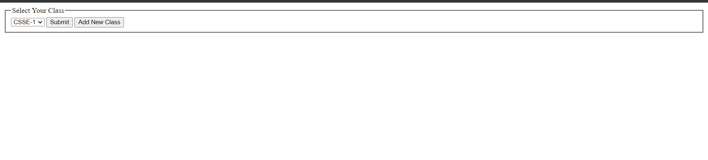
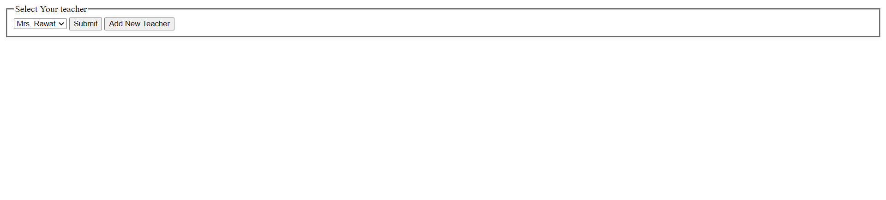
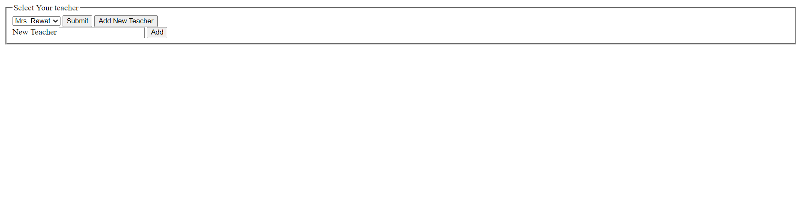
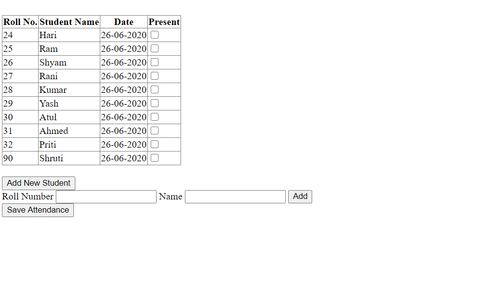

# Attendance Portal Markup

Created a Basic Attendance Portal using ASP.Net. Contains some preadded database having details like classes, teachers and students. Also have feature to add new class/teacher/student.

# Sample Shots:

For Selecting The Class

Selecting Teacher

Adding New Teacher

Adding Attendance

